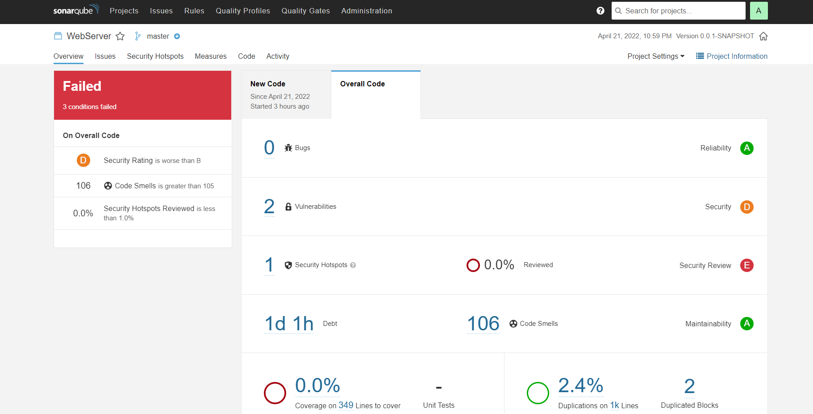

<h1> 1.f </h1>

 My project has passed the analysis, although it has 1 Bug, 1 Security Hotspot and 25 Code Smells. 

| Issue | Problem description                                                                                                                                              | How to solve                                                                                                                                                  |
| ---- |------------------------------------------------------------------------------------------------------------------------------------------------------------------|---------------------------------------------------------------------------------------------------------------------------------------------------------------|
 | Bug | Save and re-use this "Random" at Dip.java line 53                                                                                                                | Avoid reusing the random generator.                                                                                                                           |
 | Vulnerability | Make sure that using this pseudorandom number generator is safe here.                                                                                            | Use a pseudorandom number generator.                                                                                                                          |
 | Code smell (major) | Loop counter assigned inside the loop body.   Unused method parameter.   Use of prints instead of loggers.   Use of assertTrue instead of assertEquals. | * Refactor the code in order to not assign to this loop counter from within the loop body.   *Remove this unused method parameter "subset".   *Replace this use of System.out or System.err by a logger.   *Use assertEquals instead. |

<h1> 3.a </h1>

 As we have not used tests for the IES project it does not make sense using coverage as a quality gate, so I have chosen to use next gates:

 These Quality Gates were chosen because Code Smells are something to avoid aiming to develop a legible and efficient code; besides that, duplicated lines to know if more methods could have been made, Maintainability Rating to have an easily maintainable code, Reliability to check if the code has lots of bugs, Security Hotspots and Security Rating to check for vulnerabilities and Technical Debt to avoid long refactoring.

 With these QG I have reached the following results: 

<h1> 3.b </h1>

 For this exercise I basically tried only the Dispensables code smells. I have done unnecessary commentaries, duplicated codes and dead codes. After that I have reached the following results: 

